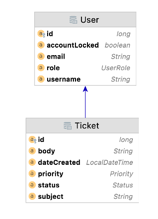

## De Helpdesk toepassing

PXL wil een helpdesk toepassing maken waar studenten en docenten problemen kunnen melden.
Voor de PXL Helpdesk ontwikkel je een RESTful API in Spring Boot.
Je implementeert enkele user story’s.
In de [README.md](README.md) vind je bijkomende informatie.
Respecteer de 3-tier architectuur van de toepassing!

### Gegeven
We maken voor onze implementatie gebruikt van een H2 database. 
De tabellen worden automatisch aangemaakt wanneer de toepassing wordt opgestart. Tijdens het opstarten wordt ook de code in de klasse ImportData (package be.pxl.helpdesk.config) uitgevoerd waardoor data in de databank geladen wordt.

De belangrijkste concepten in het domein-model zijn:
- **User**: gebruiker van het systeem. Gebruikers hebben een zelfgekozen username en een pxl-emailadres. Het beheer van gebruikers valt buiten de scope van de opdracht. Iedere gebruiker heeft een rol: ADMIN of USER. De account van een gebruiker kan ook vergrendeld (locked) zijn.
- **Ticket**: een ticket is een melding door een gebruiker aan de helpdesk. Een ticket heeft een onderwerp (subject), een body (inhoud van de melding), een prioriteit (enum Priority: HIGH, NORMAL, LOW), een status (enum Status: NEW, OPEN, SOLVED) en de gebruiker die de melding heeft gemaakt (reporter).
     
De bovenstaande klassen vind je terug in het package be.pxl.helpdesk.domain.

### Task 1

Vervolledig  de entity klassen User en Ticket. Er is GEEN bi-directionele relatie tussen de klassen User en Ticket. (zie ER-diagram)





Voeg de ontbrekende annotaties toe in de klasse UserController (package be.pxl.helpdesk.api) zodat het REST endpoint ‘GET /helpdesk/users’  aangeroepen kan worden (zie ook README.md). Na het toevoegen van de annotaties kan je de toepassing opstarten en het endpoint uittesten.


 ### Task 2: User story 1

 **Als gebruiker kan ik een ticket aanmaken.**

**Omschrijving:**

Als gebruiker geef ik mijn email-adres (reporter), een onderwerp (subject) en een inhoud (body) om een helpdesk ticket aan te maken. Ik kan ook, indien ik dat wens, de prioriteit van het ticket aanpassen.

```
POST http://localhost:8080/tickets (zie ook README.md)

{
"reporter": "589822@student.pxl.be",
"subject": "Cannot eject dvd from my laptop.",
"body": "Dvd is stuck in my laptop.",
"priority": "HIGH"
}
```

Unieke id van het aangemaakte ticket of een duidelijke foutmelding.

**Acceptatiecriteria:**\
☐ Het emailadres van de gebruiker (reporter) is verplicht.\
☐ Het onderwerp (subject) en de inhoud (body) van de melding zijn verplichte velden.\
☐ Het opgegeven email adres moet een geldig email-adres zijn. Je hoeft NIET te controleren of het een pxl-emailadres is!\
☐ priority is geen verplicht veld. Als geen priority wordt meegegeven, is de priority NORMAL.\
☐ Als er geen gebruiker bestaat met het opgegeven emailadres, dan wordt een NotFoundException opgegooid (zie createTicket() in klasse TicketService).  Deze exception geeft http-status NOT_FOUND. Het ticket wordt in dat geval niet opgeslagen.\
☐ Als de account van de gebruiker vergrendeld (locked) is, dan wordt een BusinessException opgegooid (zie createTicket() in klasse TicketService ). Deze exception geeft http-status BAD_REQUEST. Het ticket wordt dan niet opgeslagen.\
☐ Als alle gegevens geldig zijn, wordt het ticket correct opgeslagen in de databank.\

**Implementatie-details:**\
Maak een nieuwe RestController aan: TicketController waarin je het REST endpoint voorziet.
Je hebt de entity-klasse Ticket al geannoteerd.
Maak een nieuwe klasse TicketService aan waar je de methode createTicket(…) implementeert. Schrijf de nodige business-logica.

**Testen (JUnit / Mockito):**\
☐  Werk 2 relevante unit testen uit voor de methode createTicket(…) in de klasse TicketService.


### Task 3: User story 2

**Als admin of reporter van een ticket kan ik opmerkingen aan een ticket toevoegen.**

**Omschrijving:**

Enkel de reporter van een ticket of een administrator (role ADMIN) kan een opmerking aan een ticket toevoegen. De gebruiker die een comment aan een ticket toevoegt geeft zijn e-mailadres en de opmerking. Zodra een eerste opmerking aan een ticket wordt toegevoegd, wordt de status van het ticket veranderd van NEW naar OPEN. Het boolean-veld solved is optioneel. Als de waarde true is, wordt de status van het ticket aangepast naar SOLVED.

```
PUT http://localhost:8080/tickets/4 (zie ook README.md)

{
"reporter": "235340@pxl.be",
"comment": "Is there actually a dvd-player in your laptop?",
"solved": false
}
```

**Acceptatiecriteria:**\
☐ Het emailadres van de gebruiker (reporter) is verplicht.\
☐ Het opgegeven email adres moet geldig zijn.\
☐ Als er geen gebruiker bestaat met het opgegeven emailadres, dan wordt een NotFoundException opgegooid.  Deze exception geeft http-status NOT_FOUND. Het comment wordt in dat geval niet opgeslagen.\
☐ Als de account van de gebruiker vergrendeld (locked) is, dan wordt een BusinessException opgegooid. Deze exception geeft http-status BAD_REQUEST. Het comment wordt dan niet opgeslagen.\
☐ Enkel de reporter van het ticket of een gebruiker met de role ADMIN mag een comment voor een ticket aanmaken. Als deze vereiste niet voldaan is, wordt een BusinessException opgegooid. Deze exception geeft http-status BAD_REQUEST. Het comment wordt dan niet opgeslagen.\
☐ Het opgegeven ticketId (in de URL) moet een geldig ticketId zijn. Als er geen ticket bestaat met het opgegeven ticketId, dan wordt een NotFoundException opgegooid.  Deze exception geeft http-status NOT_FOUND. Het comment wordt in dat geval niet opgeslagen.\
☐ Als alle gegevens geldig zijn, wordt het comment opgeslagen in de databank.\
☐ De status van het ticket wordt aangepast van NEW naar OPEN wanneer een eerste geldig comment wordt toegevoegd.\
☐ De status van het ticket wordt aangepast van NEW of OPEN naar SOLVED wanneer boolean-veld solved true is. (Het geval dat daarna een comment wordt toegevoegd met solved false, valt buiten de scope van deze opgave).\

**Testen (JUnit / Mockito / MockMvc):**\
☐ Schrijf 1 unit test voor de RestController voor het succesvol plaatsen van een comment.\
☐ Schrijf 1 unit test voor de RestController waarbij het account van de gebruiker vergrendeld is (en er dus een BusinessException optreedt).\

**Implementatie-details:**\
☐ Voorzie het REST-endpoint.\
☐ Voeg de nodige validaties toe.\
☐ Maak de entity klasse TicketComment en zorg voor een bi-directionele relatie tussen Ticket en TicketComment. Een mogelijke implementatie zie je hieronder in het klassendiagram.\
☐ Implementeer de gevraagde businessregels, exception-handling en unit testen.\

### Task 4: User story 3

**Als gebruiker kan ik een overzicht krijgen van de tickets die ik heb aangemaakt.**

**Omschrijving:**

Voorzie een WebServlet OF een thymeleaf-template die een overzicht geeft van alle tickets van een gebruiker. 
reporter is een parameter die je moet voorzien.
```
URL: http://localhost:8080/mytickets?reporter=jwhittlesey7
```

**Acceptatiecriteria:**\
☐ Een overzichtelijke HTML-pagina met alle tickets aangemaakt door de reporter met de opgegeven username wordt getoond. Alle bijhorende comments (in chronologische volgorde) worden bij de tickets weergeven.\

**Implementatie-details:**\
Je mag dus kiezen of je gebruikmaakt van een servlet of Thymeleaf. Als je kiest voor een Servlet kan je gebruikmaken van de hulpmethoden in de klasse TicketOverviewServlet.\
Je zal ook een query moeten implementeren om alle tickets aangemaakt door de gebruiker met de opgegeven username op te halen.


**Klassendiagram:**
[diagram.pdf](images%2Fdiagram.pdf)


